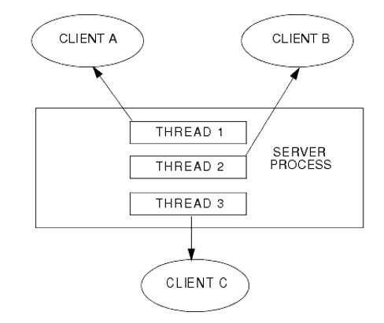
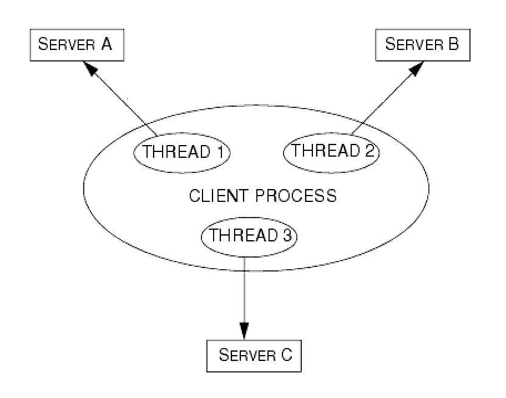
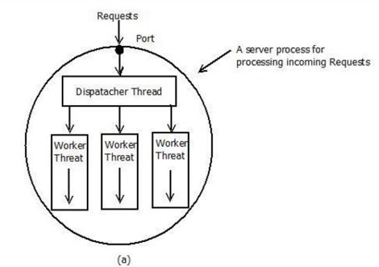

# Implementation of Multithreaded Client and Server Application in Java using Dispatcher-Worker Model.

### What is multithreading?
Multithreading is the ability of a program or an operating system process to manage its use by more than one user at a time and to even manage multiple requests by the same user without having to have multiple copies of the program running in the computer. 

### Multithreaded-Server:
A server that can handle multiple threads, where each thread is responsible to process a separate request from every client(user). 



### Multithreaded-Client:
A client that can spawn multiple threads to fetch multiple resources from multiple servers simultaneously to prevent the user from being blocked by slow I/O operations.



### Dispatcher-Worker Model:
In this model, the process consist of one dispatcher thread and several worker threads. The dispatcher thread accepts the client’s request and chooses one of the free worker threads to handover this request for further processing. Hence, multiple client requests can be processed by multiple worker threads in parallel.



## Execution:
* Compile all files.
* Run `Server.java` first.
* To demonstrate single threaded client performance, run `SingleClient.java`
* To demonstrate multi threaded client performance, run `Client.java`
* List of tasks to execute is determined by `input.txt`
* Tasks defined as per `Task.java`

#### Sample output:
**Server.java**
```
Server started.
New client connected 127.0.0.1, assigned ClientID-0.
ClientID-0 assigned to pool-1-thread-1
New client connected 127.0.0.1, assigned ClientID-1.
ClientID-1 assigned to pool-1-thread-2
New client connected 127.0.0.1, assigned ClientID-2.
ClientID-2 assigned to pool-1-thread-3
New client connected 127.0.0.1, assigned ClientID-3.
ClientID-3 assigned to pool-1-thread-4
(pool-1-thread-1) task finished.
(pool-1-thread-2) task finished.
New client connected 127.0.0.1, assigned ClientID-4.
ClientID-4 assigned to pool-1-thread-5
(pool-1-thread-3) task finished.
New client connected 127.0.0.1, assigned ClientID-5.
ClientID-5 assigned to pool-1-thread-1
(pool-1-thread-4) task finished.
New client connected 127.0.0.1, assigned ClientID-6.
ClientID-6 assigned to pool-1-thread-2
(pool-1-thread-5) task finished.
New client connected 127.0.0.1, assigned ClientID-7.
ClientID-7 assigned to pool-1-thread-3
(pool-1-thread-1) task finished.
New client connected 127.0.0.1, assigned ClientID-8.
ClientID-8 assigned to pool-1-thread-4
(pool-1-thread-2) task finished.
New client connected 127.0.0.1, assigned ClientID-9.
ClientID-9 assigned to pool-1-thread-5
(pool-1-thread-3) task finished.
New client connected 127.0.0.1, assigned ClientID-10.
ClientID-10 assigned to pool-1-thread-1
(pool-1-thread-4) task finished.
New client connected 127.0.0.1, assigned ClientID-11.
ClientID-11 assigned to pool-1-thread-2
(pool-1-thread-5) task finished.
(pool-1-thread-1) task finished.
(pool-1-thread-2) task finished.
```

**Client.java**
```
Client started.
Task assigned to pool-1-thread-1
(pool-1-thread-1) Sent: add 1 3
Task assigned to pool-1-thread-2
(pool-1-thread-2) Sent: multiply 5 6
Task assigned to pool-1-thread-3
(pool-1-thread-3) Sent: subtract 7 3
Task assigned to pool-1-thread-4
(pool-1-thread-4) Sent: add 1 7
(pool-1-thread-1) Server replied: 4 
(pool-1-thread-2) Server replied: 30 
Task assigned to pool-1-thread-5
(pool-1-thread-5) Sent: subtract 4 7
(pool-1-thread-3) Server replied: 4 
Task assigned to pool-1-thread-1
(pool-1-thread-1) Sent: multiply 6 2
(pool-1-thread-4) Server replied: 8 
Task assigned to pool-1-thread-2
(pool-1-thread-2) Sent: add 4 9
(pool-1-thread-5) Server replied: -3 
Task assigned to pool-1-thread-3
(pool-1-thread-3) Sent: subtract 5 3
(pool-1-thread-1) Server replied: 12 
Task assigned to pool-1-thread-4
(pool-1-thread-4) Sent: subtract 97 34
(pool-1-thread-2) Server replied: 13 
Task assigned to pool-1-thread-5
(pool-1-thread-5) Sent: multiply 67 12
(pool-1-thread-3) Server replied: 2 
Task assigned to pool-1-thread-1
(pool-1-thread-1) Sent: add 12 87
(pool-1-thread-4) Server replied: 63 
Task assigned to pool-1-thread-2
(pool-1-thread-2) Sent: multiply 76 23
(pool-1-thread-5) Server replied: 804 
(pool-1-thread-1) Server replied: 99 
(pool-1-thread-2) Server replied: 1748 
All tasks done!
```